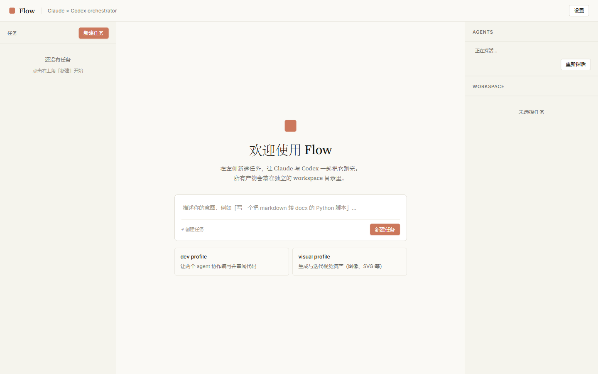
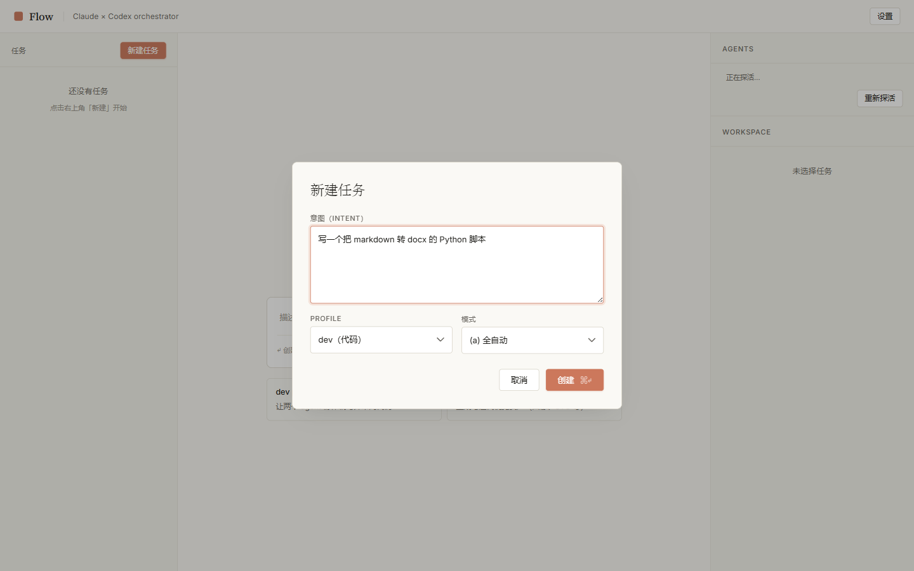
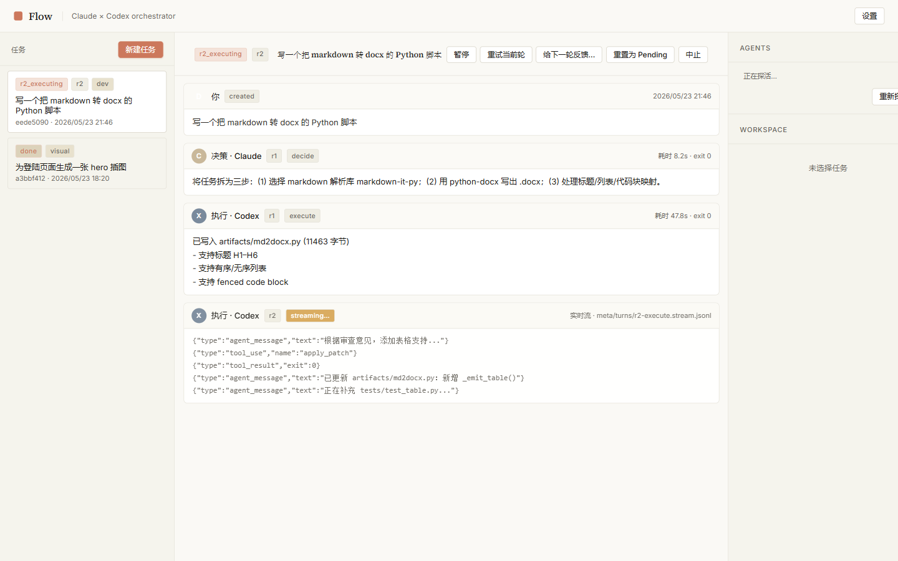
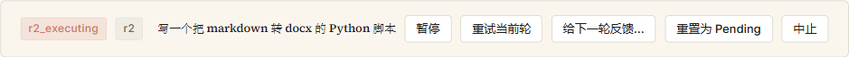
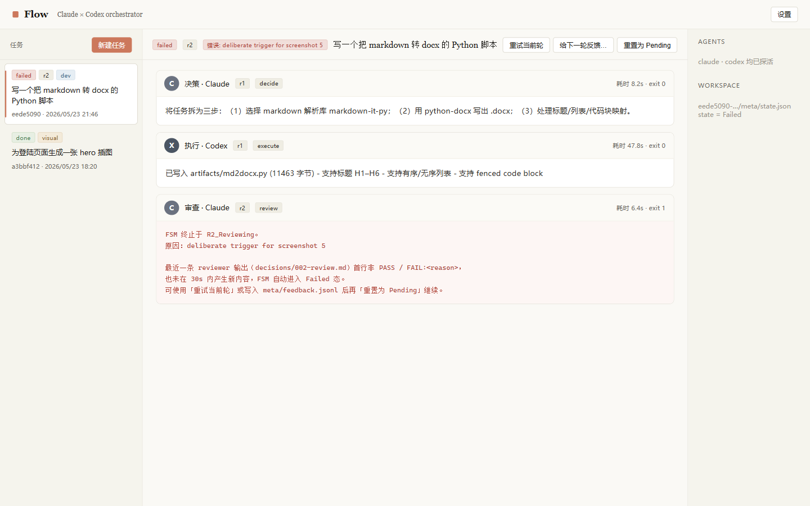

# Flow 使用教程

> Flow 是一个轻量的多 agent 协作框架：用 Tauri 2 + React 19 做桌面壳，把 `claude` 和 `codex` 两个 CLI 当子进程拉起来，按 3 轮有限状态机（R1 → R2，并在 R3 角色互换）跑一个任务。
> 内置两个 profile：`dev`（写代码）和 `visual`（做设计/规格类视觉产出）。
> 后端是 Rust，前端只通过 12 个 Tauri 命令调用。本文按"第一次上手"的顺序讲完。

---

## 1. 这是什么

- 你给一个意图（intent），比如「写一个把 markdown 转 docx 的 Python 脚本」。
- Flow 给这个任务起一块独立的 workspace 目录，里面放产物、stream 日志、FSM 状态。
- 两个 agent 轮流跑：决策者出 plan、执行者动手、审查者判 PASS/FAIL。
- 审查者如果给 FAIL，下一轮就带着上一轮的反馈继续。
- 三轮之内得到 PASS 就 Done，否则 Failed 或者停在 NeedsHuman。

界面整体是 Anthropic 风格的米色调，左边任务列表，中间是当前任务的对话流，右边是 agent 探活和 workspace 摘要。



---

## 2. 环境准备

### 2.1 需要装的东西

| 工具 | 版本 | 备注 |
| --- | --- | --- |
| Node.js | ≥ 20 | 给 Vite / pnpm 用 |
| pnpm | ≥ 9 | 包管理 |
| Rust | stable，≥ 1.78 | 给 Tauri 后端 |
| Tauri 2 prerequisites | — | Windows 上需要 WebView2 Runtime（Win11 已自带） |
| Claude Code CLI | 2.1.x | 提供 `claude` 命令 |
| Codex CLI | 0.133.x | 提供 `codex` 命令 |

Windows 上 `claude` 默认装在 `C:\Users\<你>\.local\bin\claude.cmd`，`codex` 一般在 nodejs 全局目录下，比如 `E:\develop\nodejs\codex.cmd`。Flow 会自动识别 `.cmd` / `.bat` / `.ps1` 并用 `cmd.exe /C` 或 `powershell.exe -File` 包一层启动（直接 spawn `.cmd` 在 Windows 上会失败）。

### 2.2 环境变量（可选）

如果 CLI 没在 PATH 里，或者你想强制指定路径，设两个变量：

```powershell
$env:FLOW_CLAUDE_BIN = 'C:\Users\<user>\.local\bin\claude.cmd'
$env:FLOW_CODEX_BIN  = 'E:\develop\nodejs\codex.cmd'
```

也可以在 GUI 内的「设置」里填，落到 `settings.json` 里更省心。

---

## 3. 构建与启动

PowerShell 5.1 没有 `&&`，统一用 `;` 串命令；要条件链就 `if ($?) { ... }`。

```powershell
# 一次性安装依赖
pnpm install

# 仅前端开发（Vite 起在 http://localhost:1420）
pnpm dev

# 完整桌面应用（推荐日常使用）
pnpm tauri dev

# 类型检查 / Rust 单元测试（提交前过一遍）
& 'node_modules\.bin\tsc.cmd' --noEmit
cd src-tauri ; cargo test --lib

# 不想开 GUI，纯命令行跑端到端：
cd src-tauri ; cargo run --example e2e_dev
cd src-tauri ; cargo run --example e2e_visual
```

`pnpm tauri dev` 是最常用的：自动起 Vite，再用 Tauri 套上原生壳。第一次跑会编译一会儿 Rust，之后 incremental 很快。

---

## 4. 首次配置

启动后右上角有「设置」按钮，里面三件事比较关键：

1. **workspaces 根目录**：所有任务的产物都落在这里，每个任务一个子目录（id 取头 8 位 + 完整 uuid）。默认是
   - Windows：`C:\Users\<你>\AppData\Local\flow\workspaces\`
   - 想搬到 `D:\flow-workspaces\` 之类的位置，就在这里改，保存后立即生效。
2. **Claude / Codex CLI 路径**：留空时走 PATH 或者上面提的环境变量；填了就硬覆盖。
3. **默认 profile / 模式**：新建任务时的默认值，可在新建对话框里改。

右侧 AGENTS 区会显示一次「探活」结果：调用 `--version`，如果两个 CLI 都能拉起来，状态会写「均已探活」。失败的话点「重新探活」重试，或者去设置里改路径。

---

## 5. 新建任务

点左上角 / 中间欢迎页里的「新建任务」按钮，弹出下面这个对话框：



三个字段：

- **意图（intent）**：自由描述，会原样作为 system prompt 的一部分喂给 decider。
- **profile**：`dev`（代码）/ `visual`（视觉）。两套 prompt 模板差别很大，详见后文。
- **模式**：
  - **(a) 全自动**：FSM 一路跑到 PASS / FAIL，不主动停。
  - **(s) 半自动**：每一轮结束后进入 NeedsHuman，等你手动 resume 才进下一轮。

点「创建」后会回到主界面，任务出现在左侧列表里，状态从 `pending` 起步。再点一下任务卡片，中间 pane 展开对话视图，里面有一个 ▶ 启动 按钮，点它真正开跑。

> 也可以按 ⌘/Ctrl + Enter 直接提交。

---

## 6. 运行与观察

启动后，中间窗格的标题栏会显示当前 FSM 状态（`R1_Deciding` → `R1_Executing` → `R1_Reviewing` → `R2_*` …），下面按时间顺序出现 turn 卡片：

- 头像 **C** = Claude，**X** = Codex；卡片头里附带 `r1` / `decide` / `execute` / `review` 标签和耗时、exit code。
- 正在执行的 turn 会有 `streaming…` 徽章，下方实时尾随 `meta/turns/r{n}-{role}.stream.jsonl` 的 JSON 流。
- 决策、执行的输出 markdown 会原地渲染；reviewer 那一轮的首行是 `PASS` 或 `FAIL:<原因>`，FSM 拿这一行做分支。



右侧 WORKSPACE 区可以浏览这个任务的目录，挑一个文件能在右下区域直接查看（只读）。所有重要的中间产物：

| 路径 | 含义 |
| --- | --- |
| `decisions/001-plan.md` | R1 decider 的产出 |
| `execution/001-impl.md` / `001-diff.patch` | R1 executor 的产出 |
| `decisions/001-review.md` | R1 reviewer 的判决（首行是 PASS / FAIL） |
| `meta/state.json` | FSM 的当前状态、round、history |
| `meta/turns/r1-decide.stream.jsonl` | 该轮的逐行 stream 日志 |
| `meta/interventions.jsonl` | 你按下的所有干预按钮的审计日志 |

注意文件名用零填充的 `{n}`（`001`、`002` …）—— 这是模板里的约定，FSM 也按这个查找 reviewer 文件。

---

## 7. 干预动作

正在跑的任务，标题栏右侧会出现一排小按钮：



它们的语义对应到 `meta/` 下的标志文件，FSM 每个 tick 轮询一次：

| 按钮 | 触发的文件 | 行为 |
| --- | --- | --- |
| 暂停 | `meta/control.json` ← `{"paused":true}` | 当前 turn 跑完后停住，不进下一个 |
| 恢复 | `meta/control.json` ← `{"paused":false}` | 从 NeedsHuman 继续 |
| 重试当前轮 | `meta/retry.flag` | 丢弃这一轮已写的产物，重跑同一个 role |
| 给下一轮反馈… | 追加 `meta/feedback.jsonl` 一行 `{ts,text}` | 下一轮 prompt 会把这条注入到 system message |
| 重置为 Pending | 后端 `reset_task` 命令 | 清空状态、history、所有 round 产物（含 feedback.jsonl），回到出生态 |
| 中止 | `meta/abort.flag` | 写入时间戳，FSM 在下一个 tick 把任务直接置为 Failed |

所有动作还会一并 append 到 `meta/interventions.jsonl`，事后可追溯。

---

## 8. 失败 / 标题栏错误徽章

reviewer 连续两轮 FAIL、超时无响应、或者你按了「中止」，任务都会落到 `Failed` 态。这时候标题栏左侧的 state 徽章会变成红 `failed`，紧跟一个 `err-badge`，展示截断到 40 字符的失败原因（鼠标悬停看全文）。下方对应那一轮的 turn 卡片会用单色等宽字体显示 reviewer 反馈或 FSM 自己的报错：



恢复策略：

- 想保留产物、只重跑当前 round：按「重试当前轮」。
- 想换思路：用「给下一轮反馈…」把意见写进去，再「重置为 Pending」并重新启动。
- 完全推倒：直接「重置为 Pending」，所有 history / 产物会被清空（workspace 目录里 `artifacts/` 之类用户文件不动）。

---

## 9. Profile 模板说明

`src-tauri/profiles/{dev,visual}.toml` 定义每个 profile 的三个角色，对应的 prompt 模板在 `src-tauri/profiles/templates/`：

```
dev-decider.md      dev-executor.md      dev-reviewer.md
visual-decider.md   visual-executor.md   visual-reviewer.md
```

模板里用占位符 `{n}` 引用零填充的 round 号（`001`、`002`…），**不要写 `{round}`** —— FSM 解析 `decisions/001-review.md` 这类文件名时直接拼 `{n}`。

dev profile 默认配置：

| 角色 | agent | 产物 |
| --- | --- | --- |
| decider | claude | `decisions/{n}-plan.md` |
| executor | codex | `execution/{n}-impl.md`、`execution/{n}-diff.patch` |
| reviewer | claude | `decisions/{n}-review.md` |

`[swap]` 段定义 R3 角色互换：dev 互换后 decider/reviewer 换成 codex、executor 换成 claude。visual profile 同结构，只是 prompt 偏视觉，executor 通常出 SVG / 描述性 mockup。

想新增 profile：复制一份 toml + 三个模板，在 `Settings::load()` 默认 profile 加一项即可，前端会自动从 `list_profiles`（如果开启）拿到。

---

## 10. 常见问题

**Q1. `pnpm install` 卡在某个 native 包？**
A. 不要装 `sharp`、`canvas`、`node-gyp` 这一类需要本地编译的依赖，Windows 上几乎必坏。`.npmrc` 里已经放了 `verify-deps-before-run=false` 和 `ignored-built-dependencies=esbuild` 兜底。

**Q2. 启动后 AGENTS 区一直显示「正在探活…」**
A. 大概率是 CLI 路径不对。打开「设置」直接填绝对路径；或者设置 `FLOW_CLAUDE_BIN` / `FLOW_CODEX_BIN` 环境变量再重启。

**Q3. Windows 上 codex 起不来，报「拒绝执行 .cmd」？**
A. 这是 CreateProcess 的限制。Flow 应该自动 `cmd.exe /C` 包装，确认你填的路径以 `.cmd` 或 `.bat` 结尾即可，别填到 `.js`。

**Q4. reviewer 输出第一行不是 PASS/FAIL，FSM 怎么处理？**
A. 解析失败时 FSM 会按"格式不合规"处理：当前 round 算 FAIL，进入下一轮；连续三轮都解析不出来就停到 Failed。这是规格强约束，模板里写得很清楚 reviewer 第一行必须是 `PASS` 或 `FAIL:<reason>`。

**Q5. 想看完整 stream 而不是 UI 里截断的尾巴？**
A. 去 `workspace/meta/turns/r{n}-{role}.stream.jsonl`，每行一条 JSON。也可以 `Get-Content -Wait` 实时跟。

**Q6. 任务完成后能不能复用 workspace？**
A. 可以。`reset_task` 会把 FSM 状态、history、各 round 产物清掉，但 workspace 目录本身、以及 `artifacts/` 下用户文件不会动。你可以把新意图丢到同一个任务里继续。

**Q7. CN-locale 改成英文行不行？**
A. 当前是中文构建，UI 里大量中文字符串和 Source Serif 4 字体（中文 fallback 走 Songti SC / STSong）。如果要切英文需要自己改 i18n，不在本文范围。

**Q8. 我能直接调 12 个 Tauri 命令吗？**
A. 可以，但**不要**改这 12 个命令的签名 / 参数形状（`create_task`、`list_tasks`、`get_task`、`list_workspace_files`、`read_workspace_file`、`probe_agents`、`get_settings`、`set_workspaces_root`、`reset_task`、`start_task`、`get_task_state`、`intervene`）—— 前端紧紧依赖这套 IPC 契约。要扩展请加新命令。

---

至此一个完整的 task 生命周期就走完了：新建 → 启动 → 观察 → 中途干预 → PASS / FAIL → 复盘产物。
有 bug 或想补 profile，直接改 `src-tauri/profiles/` 下的 toml + 模板即可，不用动 Rust。
